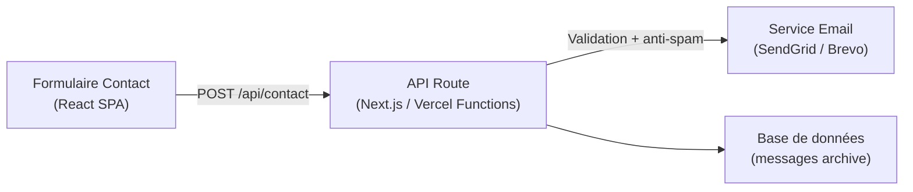

# ADR-010: Formulaire de contact — solution temporaire mailto → solution backend

## Status
Proposed

## Contexte
Le formulaire de contact actuel (`src/pages/Contact.tsx`) utilise un simple `mailto:` pour envoyer les messages. Cela :
- Nécessite que l'utilisateur ait un client email configuré
- Ne fournit aucun feedback de succès/échec côté serveur
- N'offre aucune protection contre les spams
- N'enregistre pas les messages

## Décision actuelle
Conserver le `mailto:` comme **solution temporaire** tout en préparant l'infrastructure pour une solution backend.

## Code actuel (`src/pages/Contact.tsx`)

```tsx
const handleSubmit = (e: React.FormEvent) => {
  e.preventDefault()
  const link = document.createElement('a')
  link.href = `mailto:sainbenin@yahoo.fr?subject=${encodeURIComponent(formData.subject)}&body=${encodeURIComponent(
    `Nom: ${formData.name}\nEmail: ${formData.email}\nTéléphone: ${formData.phone}\n\nMessage: ${formData.message}`
  )}`
  link.click()
}
```

## Alternatives considérées

| Option | Avantages | Inconvénents | Décision |
|--------|-----------|--------------|----------|
| **Mailto (actuel)** | Aucun code serveur, simple | Mauvaise UX, pas de feedback | ⚠️ Temporaire |
| Formspree | Simple, email delivery géré | Limite gratuite, propriétaire | ⚠️ Court terme |
| Netlify Forms | Gratuit, simple | Vercel-only (lock-in) | ❌ Rejeté |
| **Backend custom (Next.js API)** | Contrôle total, anti-spam, feedback | Complexité infra | ✅ Recommandé pour migrer |
| Formik + validation client | UX améliorée | Toujours nécessite backend | ✅ Complémentaire |

## Solution backend recommandée



### Implementation avec Vercel Functions

```
api/
├── contact.ts        # Vercel Function (Node.js)
├── validate.ts       # Schema validation (zod)
└── email.ts          # SendGrid/Brevo integration
```

### Schéma de validation

```ts
// zod schema
const contactSchema = z.object({
  name: z.string().min(2),
  email: z.string().email(),
  phone: z.string().optional(),
  subject: z.string().min(5),
  message: z.string().min(10),
})
```

## Features souhaités

1. **Validation côté client** : Erreurs en temps réel
2. **Validation côté serveur** : Zod schema
3. **Anti-spam** : Honeypot ou reCAPTCHA v3
4. **Feedback utilisateur** : Toast de succès/échec
5. **Rate limiting** : 5 messages/heure par IP
6. **Archivage** : Stocker les messages dans une base (SQLite/Vercel KV)

## Roadmap migration

| Étape | Action | Priorité |
|-------|--------|----------|
| 1 | Ajouter validation client Zod | Haute |
| 2 | Intégrer Formspree (solution simple) | Moyenne |
| 3 | Migrer vers Next.js API route ou Vercel Function | Haute |
| 4 | Ajouter anti-spam (honey pot) | Haute |
| 5 | Intégrer service email (SendGrid/Brevo) | Haute |
| 6 | Archiver messages dans base | Moyenne |

## Conséquences
- **Actuelle** : Functionalité limitée, dépendance client mail
- **Future** : Solution complète avec feedback, anti-spam, archivage

## Related ADRs
- [[007-deploiement-vercel-static]] — Vercel Functions pour le backend
- [[011-seo-sitemap-robots]] — Sitemap pour indexation